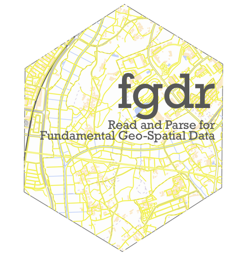

<!-- README.md is generated from README.Rmd. Please edit that file -->

```{r setup, include = FALSE}
knitr::opts_chunk$set(
  collapse = TRUE,
  comment = "#>",
  fig.path = "man/figures/README-",
  out.width = "100%"
)
```
# fgdr 

(Sorry, English version of README is not availavle for now.)

[](https://cran.r-project.org/package=fgdr)
[](https://cran.r-project.org/package=fgdr) [](https://cran.r-project.org/)

[](https://travis-ci.org/uribo/fgdr) [](https://codecov.io/gh/uribo/fgdr?branch=master)

このパッケージは、国土地理院 基盤地図情報 (**FGD**: Fundermental Geographic Data https://fgd.gsi.go.jp/download/menu.php) からダウンロードしたデータ(バージョン4.1に対応)をR上で扱うためにデータの変換を行う関数を提供します。

## Installation

パッケージのインストールは、CRANから行います。

```{r,eval = FALSE, echo = TRUE}
install.packages("fgdr")
```


開発版を利用する場合はGitHub経由でインストールします。

```{r, eval = FALSE, echo = TRUE}
install.packages("remotes")
remotes::install_github("uribo/fgdr")
```

## Example

fgdrパッケージを使った、基盤地図情報データの読み込み方法を紹介します。

なお、fgdrパッケージでは、基盤地図情報のデータをダウンロードする関数は用意していません。読み込むデータは各自でダウンロードしてください。また、読み込んだデータの扱いについても[基盤地図情報ダウンロードサービスの利用規約](https://fgd.gsi.go.jp/download/terms.html)に従ってください。

このパッケージには、基盤地図情報データダウロードサービスが提供している

- 基本項目
- 数値標高モデル (5m, 10mメッシュ)

について、データフレーム、Rの地理空間データを扱うためのクラスである[sf](https://CRAN.R-project.org/package=sf)または[raster](https://CRAN.R-project.org/package=raster) ([stars](https://github.com/r-spatial/stars))として返却する関数が備わっています。

```{r, message=FALSE}
library(fgdr)
library(raster)
library(sf)
```

## 基本項目

基本項目のデータは`read_fgd()`で読み込みます。この関数は対象のファイルの種類に応じて、自動的に地物の種類を判別して返却します。例えば、行政区画代表点 (AdmPt) では下記のようにポイントデータです。

```{r, eval = FALSE, echo = TRUE}
read_fgd("FG-GML-523346-AdmPt-20180701-0001.xml")
```

```{r, eval = TRUE, echo = FALSE}
read_fgd("data-raw/PackDLMap/FG-GML-523346-ALL-20180701/FG-GML-523346-AdmPt-20180701-0001.xml")
```

水域 (WL) はライン、行政区画 (AdmArea) はポリゴンデータになります。

```{r, eval = FALSE, echo = TRUE}
read_fgd("FG-GML-523346-AdmArea-20180701-0001.xml")
```

```{r, eval = TRUE, echo = FALSE}
read_fgd("data-raw/PackDLMap/FG-GML-523346-ALL-20180701/FG-GML-523346-AdmArea-20180701-0001.xml")
```

## 数値標高モデル

標高のメッシュデータである数値標高モデル(DEM) のデータはデータフレームまたはrasterとして読み込みます。対象のファイルが保存されているパスおよび数値標高データの種類を指定した`read_fgd_dem()`実行します。

### 5mメッシュ

```{r, eval = FALSE, echo = TRUE}
read_fgd_dem("FG-GML-5135-63-00-DEM5A-20161001.xml", 
             resolution = 5,
             return_class = "df")
```

```{r, eval = TRUE, echo = FALSE}
read_fgd_dem("data-raw/FG-GML-5135-63-DEM5A/FG-GML-5135-63-00-DEM5A-20161001.xml", 
             resolution = 5,
             return_class = "df")
```

デフォルトでは返り値のオブジェクトがデータフレームですが、これは引数`return_class = `によりrasterを選ぶことも可能です。rasterとして読み込み、可視化する例を示します。

```{r, eval = FALSE, echo = TRUE}
r <- 
  read_fgd_dem("FG-GML-5135-63-00-DEM5A-20161001.xml", 
             resolution = 5,
             return_class = "raster")
```

```{r, eval = TRUE, echo = FALSE}
r <- 
  read_fgd_dem("data-raw/FG-GML-5135-63-DEM5A/FG-GML-5135-63-00-DEM5A-20161001.xml", 
             resolution = 5,
             return_class = "raster")
```

```{r read_fgd_dem_raster_plot}
par(family = "IPAexGothic")
plot(r)
title(main = "数値標高モデル (5mメッシュ): 51356300",
      sub = "「基盤地図情報 数値標高モデル 5mメッシュ」（国土地理院）（https://fgd.gsi.go.jp/download/menu.php）\nをもとに瓜生真也(@uribo)が作成",
      cex.main = 1,
      cex.sub = 0.45,
      adj = 1)
```

### 10mメッシュ

同様に10mメッシュのデータを読み込むには`resolution =`を10に変更してください。

```{r, eval = FALSE, echo = TRUE}
read_fgd_dem("FG-GML-5440-10-dem10b-20161001.xml", 
             resolution = 10,
             return_class = "raster")
```

```{r, eval = TRUE, echo = FALSE}
read_fgd_dem("data-raw/FG-GML-5440-10-dem10b-20161001.xml", 
             resolution = 10,
             return_class = "raster")
```

## ライセンス

MIT
