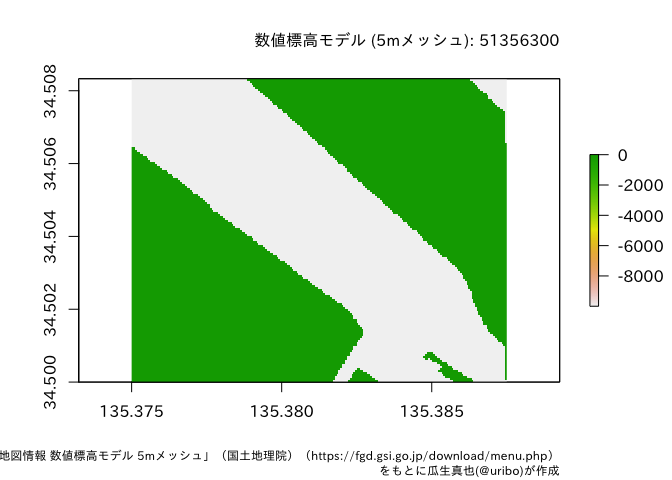

<!-- README.md is generated from README.Rmd. Please edit that file -->

# fgdr 

(Sorry, English version of README is not availavle for now.)

[](https://cran.r-project.org/package=fgdr)
[](https://cran.r-project.org/package=fgdr)
[](https://cran.r-project.org/)

[](https://travis-ci.org/uribo/fgdr)
[](https://app.codecov.io/gh/uribo/fgdr?branch=master)

このパッケージは、国土地理院 基盤地図情報 (**FGD**: Fundermental
Geographic Data <https://fgd.gsi.go.jp/download/menu.php>)
からダウンロードしたデータ(バージョン4.1に対応)をR上で扱うためにデータの変換を行う関数を提供します。

## Installation

パッケージのインストールは、CRANから行います。

``` r
install.packages("fgdr")
```

開発版を利用する場合はGitHub経由でインストールします。

``` r
install.packages("remotes")
remotes::install_github("uribo/fgdr")
```

## Example

fgdrパッケージを使った、基盤地図情報データの読み込み方法を紹介します。

なお、fgdrパッケージでは、基盤地図情報のデータをダウンロードする関数は用意していません。読み込むデータは各自でダウンロードしてください。また、読み込んだデータの扱いについても[基盤地図情報ダウンロードサービスの利用規約](https://fgd.gsi.go.jp/download/terms.html)に従ってください。

このパッケージには、基盤地図情報データダウロードサービスが提供している

-   基本項目
-   数値標高モデル (5m, 10mメッシュ)

について、データフレーム、Rの地理空間データを扱うためのクラスである[sf](https://CRAN.R-project.org/package=sf)または[raster](https://CRAN.R-project.org/package=raster)、[stars](https://CRAN.R-project.org/package=stars)、[terra](https://CRAN.R-project.org/package=terra)として返却する関数が備わっています。

``` r
library(fgdr)
library(terra)
library(sf)
```

## 基本項目

基本項目のデータは`read_fgd()`で読み込みます。この関数は対象のファイルの種類に応じて、自動的に地物の種類を判別して返却します。例えば、行政区画代表点
(AdmPt) では下記のようにポイントデータです。

``` r
read_fgd("FG-GML-523346-AdmPt-20180701-0001.xml")
```

    #> Simple feature collection with 4 features and 8 fields
    #> Geometry type: POINT
    #> Dimension:     XY
    #> Bounding box:  xmin: 133.7835 ymin: 35.00697 xmax: 133.8736 ymax: 35.06013
    #> Geodetic CRS:  JGD2011
    #> # A tibble: 4 × 9
    #>   gml_id       type  name  adm_code life_span_from development_date org_gi_level
    #>   <chr>        <chr> <chr> <chr>    <date>         <date>                  <int>
    #> 1 K6_48162126… 郡市… 真庭… 33214    2015-05-25     2018-07-03              25000
    #> 2 K6_48180126… 町村… 美咲… 33666    2015-05-25     2018-07-03              25000
    #> 3 K6_48183126… 郡市… 津山… 33203    2015-05-25     2018-07-03              25000
    #> 4 K6_48192126… 郡市… 津山… 33203    2015-05-25     2018-07-03              25000
    #> # … with 2 more variables: visibility <chr>, geometry <POINT [°]>

水域 (WL) はライン、行政区画 (AdmArea) はポリゴンデータになります。

``` r
read_fgd("FG-GML-523346-AdmArea-20180701-0001.xml")
```

    #> Simple feature collection with 4 features and 8 fields
    #> Geometry type: POLYGON
    #> Dimension:     XY
    #> Bounding box:  xmin: 133.75 ymin: 35 xmax: 133.875 ymax: 35.08333
    #> Geodetic CRS:  JGD2011
    #> # A tibble: 4 × 9
    #>   gml_id       type  name  adm_code life_span_from development_date org_gi_level
    #>   <chr>        <chr> <chr> <chr>    <date>         <date>                  <int>
    #> 1 K4_523346_1… 町村… 美咲… 33666    2018-07-02     2018-07-03              25000
    #> 2 K4_523346_2… 郡市… 真庭… 33214    2018-07-02     2018-07-03              25000
    #> 3 K4_523346_3… 郡市… 津山… 33203    2018-07-02     2018-07-03              25000
    #> 4 K4_523346_4… 郡市… 津山… 33203    2018-07-02     2018-07-03              25000
    #> # … with 2 more variables: visibility <chr>, geometry <POLYGON [°]>

## 数値標高モデル

標高のメッシュデータである数値標高モデル(DEM)
のデータはデータフレームまたはrasterとして読み込みます。対象のファイルが保存されているパスおよび数値標高データの種類を指定した`read_fgd_dem()`実行します。

### 5mメッシュ

``` r
read_fgd_dem("FG-GML-5135-63-00-DEM5A-20161001.xml", 
             resolution = 5,
             return_class = "data.table")
```

    #>              type     value
    #>     1: データなし    NA [m]
    #>     2: データなし    NA [m]
    #>     3: データなし    NA [m]
    #>     4: データなし    NA [m]
    #>     5: データなし    NA [m]
    #>    ---                     
    #> 33746:     内水面 -9999 [m]
    #> 33747:     内水面 -9999 [m]
    #> 33748:     内水面 -9999 [m]
    #> 33749:     内水面 -9999 [m]
    #> 33750:     内水面 -9999 [m]

デフォルトでは返り値のオブジェクトがデータフレームですが、これは引数`return_class =`によりrasterやstars、terraのいずれかを選ぶことも可能です。terraとして読み込み、可視化する例を示します。

``` r
r <- 
  read_fgd_dem("FG-GML-5135-63-00-DEM5A-20161001.xml", 
             resolution = 5,
             return_class = "terra")
```

``` r
par(family = "IPAexGothic")
plot(r)
title(main = "数値標高モデル (5mメッシュ): 51356300",
      sub = "「基盤地図情報 数値標高モデル 5mメッシュ」（国土地理院）（https://fgd.gsi.go.jp/download/menu.php）\nをもとに瓜生真也(@uribo)が作成",
      cex.main = 1,
      cex.sub = 0.45,
      adj = 1)
```



### 10mメッシュ

同様に10mメッシュのデータを読み込むには`resolution =`を10に変更してください。

``` r
read_fgd_dem("FG-GML-5440-10-dem10b-20161001.xml", 
             resolution = 10,
             return_class = "raster")
```

    #> class      : RasterLayer 
    #> dimensions : 750, 1125, 843750  (nrow, ncol, ncell)
    #> resolution : 0.0001111111, 0.00011112  (x, y)
    #> extent     : 140, 140.125, 36.08333, 36.16667  (xmin, xmax, ymin, ymax)
    #> crs        : +proj=longlat +ellps=GRS80 +no_defs 
    #> source     : memory
    #> names      : layer 
    #> values     : 5, 316  (min, max)

## ライセンス

MIT
