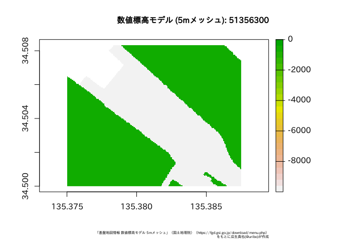

<!-- README.md is generated from README.Rmd. Please edit that file -->

# fgdr

このパッケージは、国土地理院 基盤地図情報 (**FGD**: Fundermental Geographic Data
<https://fgd.gsi.go.jp/download/menu.php>)
からダウンロードしたデータ(バージョン4.1に対応)をR上で扱うためにデータの変換を行う関数を提供します。

## Installation

パッケージのインストールは、GitHub (このリポジトリ) から行います。

``` r
install.packages("remotes")
remotes::install_github("uribo/fgdr")
```

## Example

fgdrパッケージを使った、基盤地図情報データの読み込み方法を紹介します。

なお、fgdrパッケージでは、基盤地図情報のデータをダウンロードする関数は用意していません。読み込むデータは各自でダウンロードしてください。また、読み込んだデータの扱いについても基盤地図情報ダウンロードサービスの利用規約に従ってください。

このパッケージには、基盤地図情報データダウロードサービスが提供している

  - 基本項目
  - 数値標高モデル (5m,
10mメッシュ)

について、データフレーム、Rの地理空間データを扱うためのクラスである[sf](https://CRAN.R-project.org/package=sf)または[raster](https://CRAN.R-project.org/package=raster)
([stars](https://github.com/r-spatial/stars)については準備中)として返却する関数が備わっています。

``` r
library(fgdr)
library(raster)
#> Loading required package: sp
library(sf)
#> Linking to GEOS 3.7.0, GDAL 2.3.2, PROJ 5.2.0
```

## 基本項目

基本項目のデータは`read_fgd()`で読み込みます。この関数は対象のファイルの種類に応じて、自動的に地物の種類を判別して返却します。例えば、行政区画代表点
(AdmPt) では下記のようにポイントデータです。

``` r
read_fgd("FG-GML-523346-AdmPt-20180701-0001.xml")
```

    #> Simple feature collection with 4 features and 2 fields
    #> geometry type:  POINT
    #> dimension:      XY
    #> bbox:           xmin: 133.7835 ymin: 35.00697 xmax: 133.8736 ymax: 35.06013
    #> epsg (SRID):    4326
    #> proj4string:    +proj=longlat +datum=WGS84 +no_defs
    #>              gml_id adm_name                  geometry
    #> 1 K6_4816212612_1-2   真庭市  POINT (133.7835 35.0416)
    #> 2 K6_4818012606_1-2   美咲町 POINT (133.8394 35.02376)
    #> 3 K6_4818312621_1-2   津山市 POINT (133.8496 35.06013)
    #> 4 K6_4819212600_1-2   津山市 POINT (133.8736 35.00697)

水域 (WL) はライン、行政区画 (AdmArea) はポリゴンデータになります。

``` r
read_fgd("FG-GML-523346-AdmArea-20180701-0001.xml")
```

    #> Simple feature collection with 4 features and 2 fields
    #> geometry type:  POLYGON
    #> dimension:      XY
    #> bbox:           xmin: 133.75 ymin: 35 xmax: 133.875 ymax: 35.08333
    #> epsg (SRID):    4326
    #> proj4string:    +proj=longlat +datum=WGS84 +no_defs
    #>          gml_id adm_name                       geometry
    #> 1 K4_523346_1-2   美咲町 POLYGON ((133.7869 35, 133....
    #> 2 K4_523346_2-2   真庭市 POLYGON ((133.7879 35.00639...
    #> 3 K4_523346_3-2   津山市 POLYGON ((133.8742 35.00319...
    #> 4 K4_523346_4-2   津山市 POLYGON ((133.8746 35.03678...

## 数値標高モデル

標高のメッシュデータである数値標高モデル(DEM)
のデータはデータフレームまたはrasterとして読み込みます。対象のファイルが保存されているパスおよび数値標高データの種類を指定した`read_fgd_dem()`実行します。

### 5mメッシュ

``` r
read_fgd_dem("FG-GML-5135-63-00-DEM5A-20161001.xml", 
             resolution = 5)
```

    #> # A tibble: 33,750 x 2
    #>    type       value
    #>    <chr>      <dbl>
    #>  1 データなし -9999
    #>  2 データなし -9999
    #>  3 データなし -9999
    #>  4 データなし -9999
    #>  5 データなし -9999
    #>  6 データなし -9999
    #>  7 データなし -9999
    #>  8 データなし -9999
    #>  9 データなし -9999
    #> 10 データなし -9999
    #> # ... with 33,740 more rows

デフォルトでは返り値のオブジェクトがデータフレームですが、これは引数`return_class
=`によりrasterを選ぶことも可能です。rasterとして読み込み、可視化する例を示します。

``` r
r <- 
  read_fgd_dem("FG-GML-5135-63-00-DEM5A-20161001.xml", 
             resolution = 5,
             return_class = "raster")
```

``` r
par(family = "IPAexGothic")
plot(r)
title(main = "数値標高モデル (5mメッシュ): 51356300",
      sub = "「基盤地図情報 数値標高モデル 5mメッシュ」（国土地理院）（https://fgd.gsi.go.jp/download/menu.php）\nをもとに瓜生真也(@uribo)が作成",
      cex.main = 1,
      cex.sub = 0.45,
      adj = 1)
```



### 10mメッシュ

同様に10mメッシュのデータを読み込むには`resolution =`を10に変更してください。

``` r
read_fgd_dem("FG-GML-5440-10-dem10b-20161001.xml", 
             resolution = 10,
             return_class = "raster")
```

    #> class       : RasterLayer 
    #> dimensions  : 750, 1125, 843750  (nrow, ncol, ncell)
    #> resolution  : 0.0001111111, 0.00011112  (x, y)
    #> extent      : 140, 140.125, 36.08333, 36.16667  (xmin, xmax, ymin, ymax)
    #> coord. ref. : +proj=longlat +datum=WGS84 +no_defs +ellps=WGS84 +towgs84=0,0,0 
    #> data source : in memory
    #> names       : layer 
    #> values      : -9999, 316  (min, max)

## ライセンス

MIT
